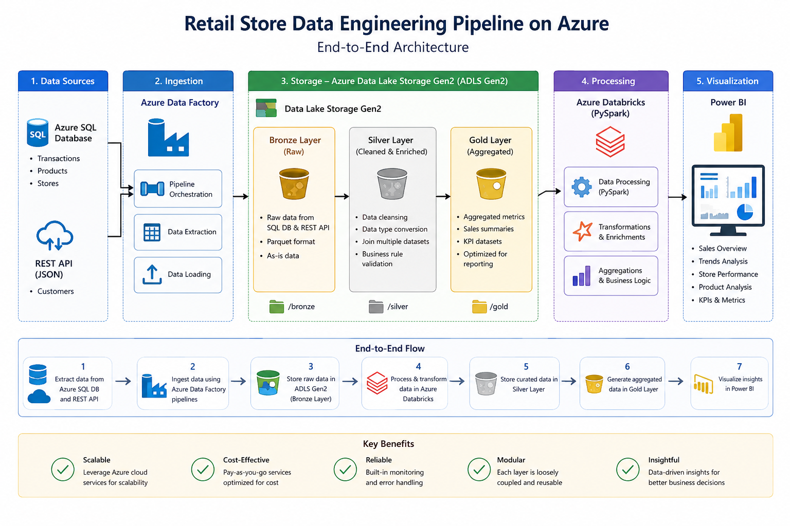
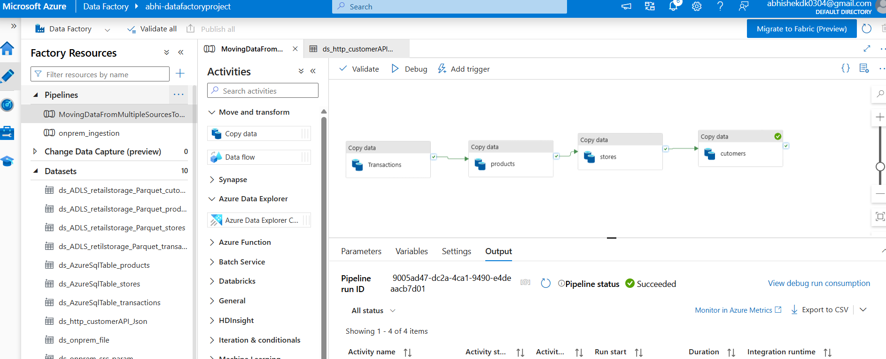
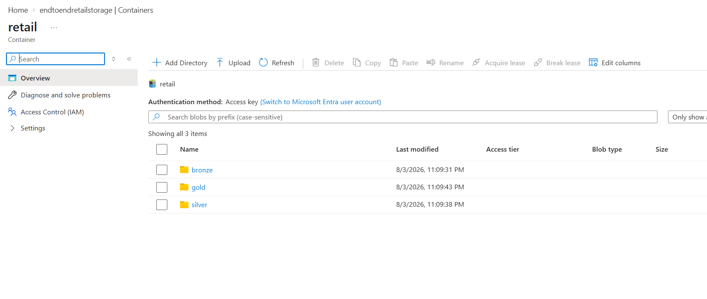
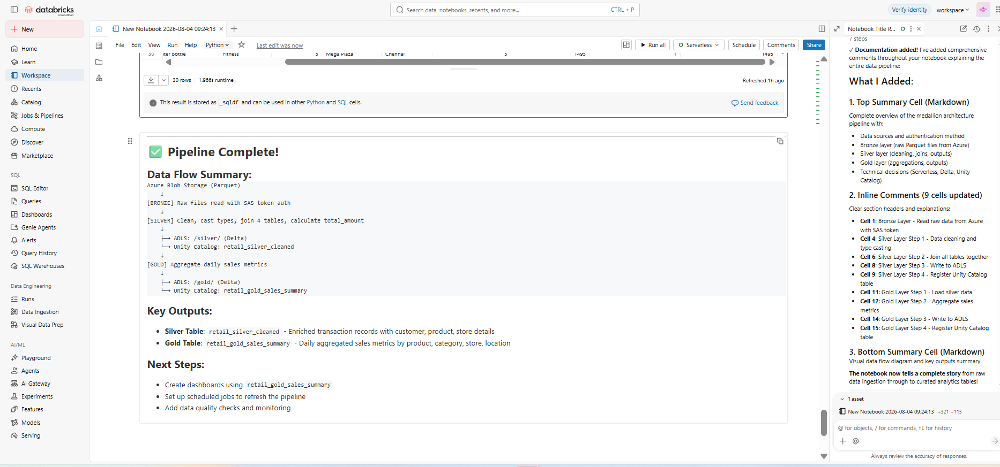
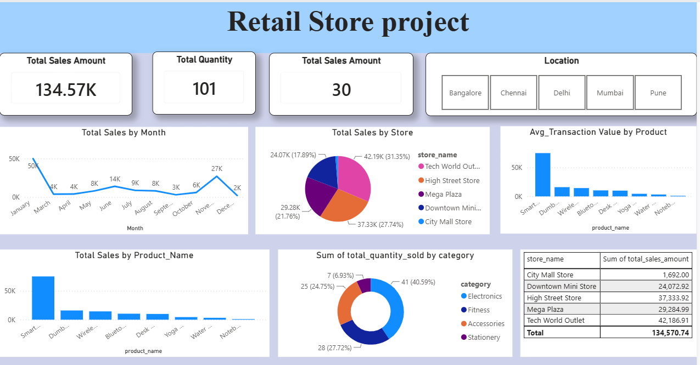

# Retail Store Data Engineering Pipeline on Azure

## Project Overview

This project demonstrates an end-to-end Azure Data Engineering pipeline that ingests retail sales data from multiple sources, processes it using Azure Databricks with PySpark, stores curated datasets in Azure Data Lake Storage Gen2 using the Medallion Architecture (Bronze, Silver, Gold), and visualizes business insights using Power BI.

The project simulates a real-world retail analytics solution by integrating structured data from Azure SQL Database and semi-structured customer data from a REST API.

---

## Technologies Used

- Azure Data Factory (ADF)
- Azure Data Lake Storage Gen2 (ADLS Gen2)
- Azure SQL Database
- Azure Databricks
- PySpark
- Spark SQL
- Parquet
- REST API (JSON)
- Power BI
  
## Data Sources

The project integrates data from multiple sources:

| Source | Format | Description |
|--------|--------|-------------|
| Azure SQL Database | Tables | Transactions, Products, Stores |
| REST API | JSON | Customer Information |

## End-to-End Pipeline Workflow

1. Extracted transaction, product, and store data from Azure SQL Database using Azure Data Factory.
2. Retrieved customer data from a REST API in JSON format.
3. Loaded all source data into Azure Data Lake Storage Gen2 Bronze layer in Parquet format.
4. Processed Bronze data in Azure Databricks using PySpark.
5. Performed data cleansing, datatype conversions, joins, and business transformations to create Silver datasets.
6. Generated business metrics and aggregations from Silver data to create Gold datasets.
7. Stored Silver and Gold datasets in ADLS Gen2 following the Medallion Architecture.
8. Used the Gold dataset for reporting and visualization in Power BI.

   Azure SQL Database
├── Transactions
├── Products
└── Stores

REST API (JSON)
└── Customers

        ↓

Azure Data Factory

        ↓

ADLS Gen2 (Bronze)

        ↓

Azure Databricks (PySpark)

        ↓

ADLS Gen2 (Silver)

        ↓

Azure Databricks (Aggregations)

        ↓

ADLS Gen2 (Gold)

        ↓

Power BI Dashboard

## Medallion Architecture

### Bronze Layer
- Raw data ingested from Azure SQL Database and REST API
- Stored in ADLS Gen2 in Parquet format

### Silver Layer
- Data cleansing
- Data type conversion
- Joining multiple datasets
- Business rule validation

### Gold Layer
- Aggregated business metrics
- Sales summaries
- KPI datasets optimized for reporting

## Project Architecture

## Project Screenshots

### Azure Data Factory Pipeline

### Azure Data Lake Storage (Bronze, Silver, Gold)

### Azure Databricks Pipeline

### Power BI Dashboard

## Repository Structure

Retail-Store-Data-Engineering-Azure
│
├── Architecture
├── Azure-Data-Factory
├── Databricks
├── Images
├── PowerBI
├── README.md

## Key Learning Outcomes

- Built an end-to-end Azure Data Engineering pipeline.
- Implemented Azure Data Factory for data ingestion.
- Processed large datasets using Azure Databricks and PySpark.
- Applied Medallion Architecture (Bronze, Silver, Gold).
- Performed data cleansing, transformations, and aggregations.
- Created analytical datasets for reporting.
- Built Power BI dashboards using curated Gold-layer data.
